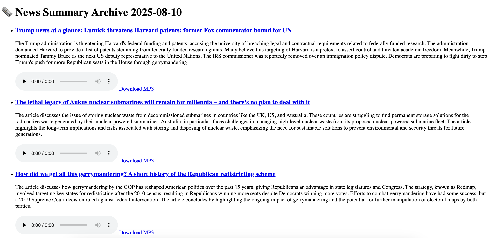

# newslite


# 📰 News Summarization API

A small **FastAPI** service that fetches articles from **The Guardian Open Platform** and (optionally) summarizes them with the **OpenAI API**. For now, summaries can also be served from sample data while the OpenAI billing policy is undecided.

---

## 📁 Project Structure


app/
├── main.py # FastAPI endpoints
├── guardian_client.py # Guardian API fetch logic (+ debug / standalone run)
├── summary_llm.py # OpenAI-based summarizer (can be disabled for now)
.env.example # Template for environment variables
requirements.txt
README.md


---

## 🚀 Tech Stack

- **FastAPI**
- **httpx**
- **python-dotenv**
- **OpenAI API** (optional / on hold)
- **The Guardian Open Platform API**

---

## 🔧 Setup

### 1) Clone & install

```bash
git clone <your-repo-url>
cd <your-repo>
pip install -r requirements.txt
```


### 2) Environment variables
Copy the example and fill in your keys:

```bash
cp .env.example .env
```

.env.example
```bash
GUARDIAN_API_KEY=your_guardian_api_key_here
OPENAI_API_KEY=your_openai_api_key_here
```


### 🔑 How to get API keys
Guardian API
Go to: https://open-platform.theguardian.com/access/

Sign up / log in, create a Developer key

Put it into .env as GUARDIAN_API_KEY

OpenAI API (optional / currently paused)
Go to: https://platform.openai.com/account/api-keys

Create a secret key

Put it into .env as OPENAI_API_KEY


### 🧪 Run locally (FastAPI)

```bash
uvicorn app.main:app --reload
```

### Interactive docs
Swagger UI: http://127.0.0.1:8000/docs


ReDoc: http://127.0.0.1:8000/redoc


Endpoints
GET /guardian
Fetch raw Guardian articles.

```bash
/guardian?q=technology&count=1
```

Response (example):

```json
{
  "source": "guardian",
  "articles": [
    {
      "title": "Example title",
      "url": "https://www.theguardian.com/...",
      "content": "..."
    }
  ]
}

```

GET /summary
Summarize fetched articles (uses OpenAI when enabled).

```bash
/summary?q=technology&count=1
```

```json
{
  "source": "guardian",
  "summaries": [
    {
      "title": "Example title",
      "url": "https://www.theguardian.com/...",
      "summary": "Simplified summary text ..."
    }
  ]
}

```

GET /sample_summaries
Returns hard-coded sample summaries (no OpenAI call). <------ 2025 Jul 26 ver.


## 🧪 Standalone unit test (no FastAPI)
You can run the Guardian fetcher directly:

```bash
python app/guardian_client.py

```

Sample output:

```bash

<<< STATUS CODE >>> 200
<<< RESPONSE TEXT START >>> {"response":{"status":"ok","userTier":"developer","total":151911,"startIndex":1,"pageSize":1,"currentPage":1,"pages":151911,"orderBy":"newest","results":[{"id":"music/2025/jul/26/king-gizzard-and-the-
<<< RESPONSE TEXT END >>>
Title: King Gizzard and the Lizard Wizard join Spotify exodus over arms industry link
URL: https://www.theguardian.com/music/2025/jul/26/king-gizzard-and-the-lizard-wizard-join-spotify-exodus-over-arms-industry-link-ntwnfb
Content Preview: King Gizzard and the Lizard Wizard have joined an exodus of musicians from Spotify in protest against the music streaming site’s CEO’s links with the defence industry. “Fuck Spotify,” the prolific Aus
========================================


```
debug=True will print trimmed fields to keep terminal output readable.
The function always returns articles regardless of the debug flag.


## 📰 Daily News Summary Generation
This project includes a daily summary feature that fetches and summarizes articles from The Guardian in three categories: technology, climate, and education.

🛠 Run the summary job manually
To fetch and summarize the latest articles, run:


```husb
PYTHONPATH=. python scripts/daily_summary_job.py
````


Summaries will be saved as a JSON file under data/, named like:
data/daily_summary_2025-08-01.json

The script will skip execution if a summary for today already exists.

(Optional) You can set USE_DUMMY=true in .env for testing without calling the OpenAI API.

🌐 View the summaries in browser
After generating the summary file, you can access the /daily endpoint:

```bash
http://localhost:8000/daily

````
This renders the latest daily summaries using the saved JSON.


## 💰 Token / Cost Control Strategy Before Enabling OpenAI in Production

To prevent excessive API usage and unexpected billing, this project includes a lightweight usage tracker.

📊 Usage Tracking with usage_tracker.json
OpenAI API calls are tracked via a local JSON file:
data/usage_tracker.json

Example content:

```json
{
  "total_cost_usd": 2.14,
  "last_reset": "2025-08-01"
}

```

🔒 Monthly Cost Limit
A monthly hard limit (default: $3.00) is enforced in code.

When the cost exceeds the limit, API calls are blocked, and a warning is raised.

⚙️ How It Works
Every time a summary is generated using the OpenAI API, an estimated cost (e.g., $0.01) is logged by:

```python
from app.usage_tracker import check_and_log_usage

check_and_log_usage(0.01)
```
The tracker will automatically reset at the start of each month.

## 🧪 Testing Without API Calls
For development or offline testing, enable dummy mode by adding the following to .env:

```env
USE_DUMMY=true
This will bypass OpenAI and return placeholder summaries.
```


## 🆕 New Features
## ✅ Save Full Articles
The daily_summary_job.py script now saves not only the summaries but also the original full articles retrieved from the Guardian API.

File location: data/daily_full_article_YYYY-MM-DD.json

Contents: Each article includes title, url, bodyText, and other metadata under the fields key.

This allows for later reference or reprocessing of the full article content.

## ✅ Archive Summary by Date (HTML View)
A new archive view is available to browse saved summaries by date using FastAPI and Jinja2 templates.

URL format:
http://localhost:8000/archive/YYYY-MM-DD
(e.g., http://localhost:8000/archive/2025-08-04)

Data source:
Reads from data/daily_summary_YYYY-MM-DD.json

Rendered using:
app/templates/archive.html template

Each article summary is displayed with a link to the original article and its summarized content.

## Audio Playback and Download

For each vocabulary entry, you can play the corresponding MP3 audio directly in your browser or download it for offline use.

- **Play in Browser:** Click the play button to listen to the pronunciation or example sentence.
- **Download MP3:** Click the download icon or link to save the file locally.

> **Note:** The screenshots below are provided for illustration purposes only. The actual user interface may change in future updates.

### Example




## 📄 Docs

See [OpenAI Pricing Notes](docs/cost/openai_pricing_notes.md) for details on token usage and cost estimation.


## Static Type Checking (mypy)
The project includes mypy as part of the CI pipeline,
using a relaxed configuration suitable for rapid prototyping.
Full type annotations are not enforced,
but the setup demonstrates awareness of static analysis and maintainability.

## 🧭 Roadmap

- [x] Token / cost control strategy (moved to `docs/cost/openai_pricing_notes.md`)
- [x] Basic Polly integration & mp3 generation from JSON summaries
- [ ] Better error handling & logging
- [ ] Async summarization & batching
- [ ] Result caching (to avoid repeated Guardian/OpenAI calls)
- [ ] Simple HTML front-end (Jinja2 or Streamlit)
- [ ] Optional AWS Polly voice selection (per user or article)
- [ ] CLI tool to synthesize and preview articles
- [ ] Rate limit safeguards & alerting (OpenAI / AWS)

